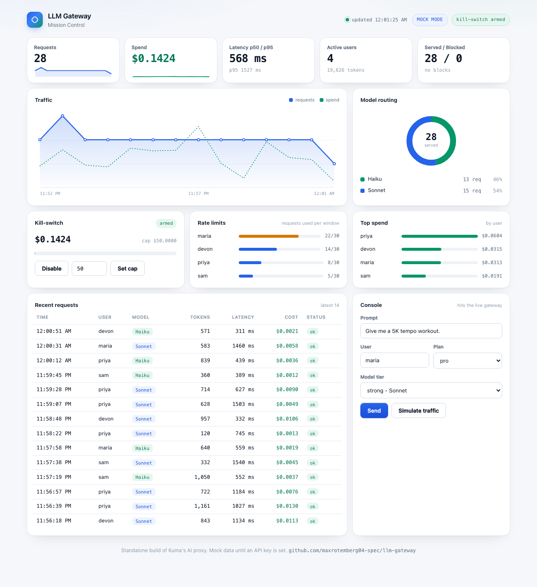

# llm-gateway


A **gateway in front of the LLM API** — the infrastructure layer that makes AI apps affordable and safe to run: per-user rate limiting, cheap/strong model routing, token-cost accounting, latency tracking, fallback, and a global kill-switch. All watched from a live dashboard.

It's a standalone build of **my production app's** production AI proxy (an AI running coach) — the same design that runs in its Supabase edge functions.



## Why a gateway exists
Call an LLM API directly from your app and you get: no cost visibility, no per-user limits, no fallback when a model errors, and your API key one decompile away from public. Every serious AI product routes traffic through a proxy that fixes all four. This is that proxy, small enough to read.

## Features
| | |
|---|---|
| **Proxy** | one `POST /chat` your app calls instead of the LLM API |
| **Model routing** | `cheap` (Haiku) vs `strong` (Sonnet) per request |
| **Rate limiting** | per-user request caps on rolling windows (free: 5/week, pro: 30/day) — the Redis `INCR`+`EXPIRE` pattern |
| **Cost accounting** | tokens × price per request, per user, per model |
| **Latency** | p50 / p95 tracked per request |
| **Kill-switch** | one switch blocks all traffic past a monthly spend cap |
| **Fallback** | a failing model falls back to the other tier |
| **Mock mode** | runs with **no API key** — always demos |
| **Dashboard** | live Mission Control: traffic, routing share, spend, limits, kill-switch, request console |
| **Tests + CI** | API test suite runs on every push |

## Run it (no key needed)
```bash
python3 -m venv .venv
source .venv/bin/activate
pip install -r requirements.txt
uvicorn app.main:app --reload
```
Open **http://localhost:8000** — the dashboard seeds itself with labeled mock data. Set `ANTHROPIC_API_KEY` to proxy real Claude instead.

## API
| Endpoint | What it does |
|---|---|
| `POST /chat` | `{prompt, user_id, plan, tier, system}` → reply + tokens + latency + cost |
| `GET /stats` | totals, p50/p95, per-model + per-user breakdowns |
| `GET /stats/timeseries` | request + spend buckets for the chart |
| `GET /stats/recent` | latest requests |
| `GET /limits` | per-user rate-limit usage |
| `GET/POST /killswitch` | read / arm / set the spend cap |

```bash
curl -s localhost:8000/chat -H 'content-type: application/json' \
  -d '{"prompt":"give me a tempo run","user_id":"maria","plan":"pro","tier":"strong"}'
```

## How a request flows
```
app ── POST /chat ──► kill-switch? ──► rate limit? ──► route tier ──► call model
                        │ blocked        │ 429-style      cheap/strong   │ error? fallback
                        ▼                ▼                               ▼
                     recorded ◄──────── recorded ◄──── cost + latency recorded ──► dashboard
```

## Design notes
- **In-memory state, single process** — right-sized for a portfolio proxy; the seams for SQLite/Redis are marked in `app/metrics.py` and `app/ratelimit.py`.
- The rate limiter is the exact counter-with-TTL pattern from my [redis-clone](https://github.com/maxrotemberg04-spec/redis-clone).
- Dashboard is dependency-free vanilla HTML/CSS/JS (hand-rolled SVG charts) — no build step.

## Tests
```bash
python -m unittest discover -s tests
```
Covers: model routing + pricing, free-tier rate limit tripping, kill-switch block/recover, stats shape, dashboard serving.

## Roadmap
- [ ] SQLite persistence for usage rows
- [ ] Auth on the dashboard + admin endpoints
- [ ] Streaming responses (SSE pass-through)
- [ ] Per-model daily budgets

## How it maps to my production app
my production app's backend spec locks the same decisions this repo implements: an AI proxy that owns the prompts, per-plan rate limits (5/week free, ~30/day pro), Sonnet/Haiku routing, token-cost rows feeding a Mission Control view, and a global monthly kill-switch. This repo is that system, standalone and readable.
